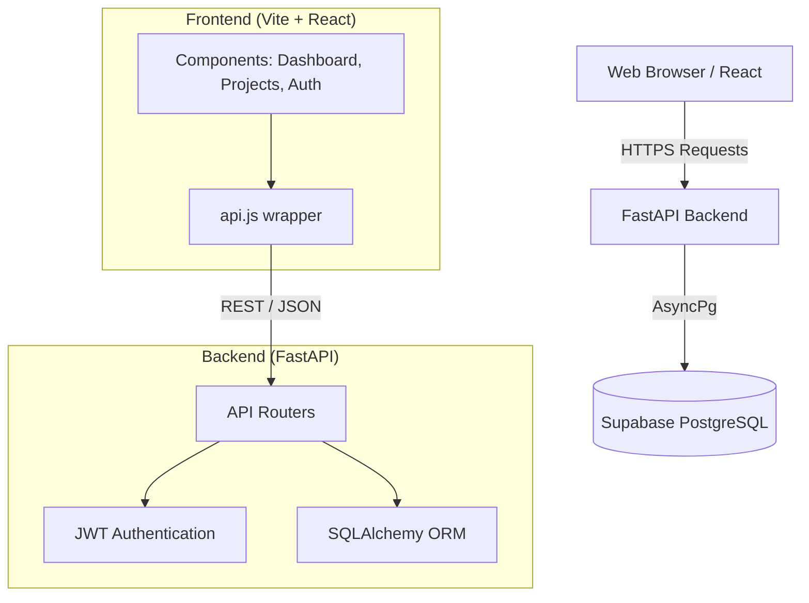
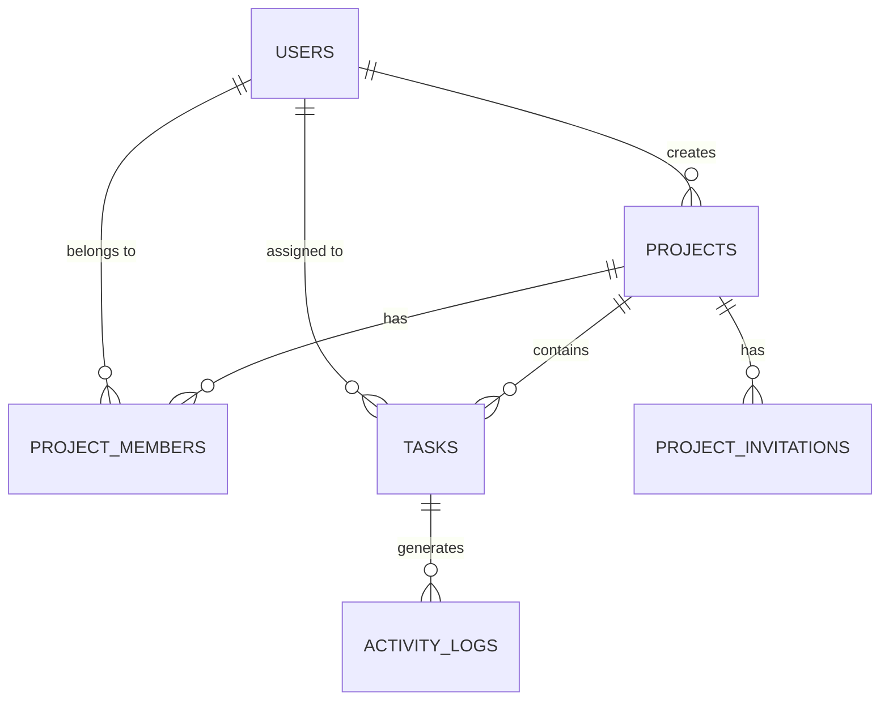

# TeamFlow - Task Management System

TeamFlow is a full-stack, real-time task and project management dashboard designed for modern teams. It features a beautifully minimal React frontend and a highly performant FastAPI backend powered by PostgreSQL.

## 🏗️ Architecture



## 🚀 Tech Stack

### Frontend (Deployed on Vercel)
- **Framework**: React 18 with Vite
- **Styling**: Vanilla CSS with CSS Variables (Monochrome Design System)
- **Icons**: Custom SVG components
- **Routing**: Conditional state-based SPA routing (Lightning fast)

### Backend (Deployed on Railway)
- **Framework**: FastAPI (Python 3.10+)
- **Database**: PostgreSQL (via Supabase)
- **ORM**: SQLAlchemy (Async)
- **Authentication**: JWT (JSON Web Tokens) with bcrypt password hashing

---

## 🛠️ Local Development Setup

### 1. Backend Setup
```bash
cd backend
python -m venv venv
# Activate virtual environment:
# Windows: .\venv\Scripts\activate
# Mac/Linux: source venv/bin/activate

pip install -r requirements.txt
```

Create a `.env` file in the `backend` directory:
```env
DATABASE_URL=postgresql+asyncpg://<your-supabase-db-url>
SUPABASE_JWT_SECRET=<your-jwt-secret>
```

Start the backend:
```bash
uvicorn app.main:app --reload
```

### 2. Frontend Setup
```bash
cd frontend
npm install
npm run dev
```

---

## 🌍 Deployment Guide

The recommended deployment architecture is **Frontend on Vercel** and **Backend on Railway**. This gives you the best performance for React and the best environment for running Python servers.

### 1. Deploy Backend to Railway
1. Push this repository to GitHub.
2. Log into [Railway.app](https://railway.app/).
3. Create a **New Project** -> **Deploy from GitHub repo**.
4. Select your repository.
5. In the Railway project settings, go to **Settings > Root Directory** and set it to `/backend`.
6. Go to **Variables** and add:
   - `DATABASE_URL`
   - `SUPABASE_JWT_SECRET`
7. Railway will automatically detect the `Procfile` and start the FastAPI server.
8. Once deployed, copy your Railway Public URL (e.g., `https://teamflow-api.up.railway.app`).

### 2. Deploy Frontend to Vercel
1. Log into [Vercel.com](https://vercel.com/).
2. Create a **New Project** -> **Import from GitHub**.
3. Select your repository.
4. In the configuration settings:
   - **Framework Preset**: Vite
   - **Root Directory**: `frontend`
5. Go to **Environment Variables** and add:
   - `VITE_API_URL` = `https://teamflow-api.up.railway.app` *(Your Railway URL)*
6. Click **Deploy**. Vercel will build the app and handle SPA routing via the `vercel.json` configuration.

---

## 📊 Database Schema



## ✨ Key Features
- **Instant SPA Navigation**: Zero-delay caching system between views.
- **Role-Based Access**: Admin and Member permissions for projects.
- **Real-Time Dashboards**: Automatic calculation of overdue, pending, and completed tasks.
- **Strong Security**: Encrypted passwords, strict Pydantic validation, and JWT session handling.
